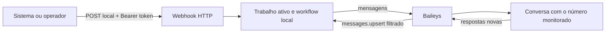

# Bot local de correção de nome via WhatsApp — LATAM

Projeto open source para conduzir, em uma conta de WhatsApp autorizada, o fluxo de solicitação de correção de nome usado no atendimento da LATAM. O bot roda localmente, conecta-se ao WhatsApp por QR Code com Baileys e só reage a mensagens novas do número configurado pelo operador.

> [!WARNING]
> Este é um projeto independente e não oficial. Não é afiliado, patrocinado, aprovado ou mantido pela LATAM Airlines Group, pela Meta, pelo WhatsApp ou pelos mantenedores do Baileys. A integração usa uma interface não oficial do WhatsApp e pode parar de funcionar ou provocar restrições na sessão/conta. Use somente uma conta autorizada, sem spam, e respeite os termos aplicáveis, a LGPD e as regras do canal atendido.

## Comece aqui: todos os comandos

O fluxo completo no Windows é este. Os comandos devem ser executados no **PowerShell**, não diretamente no Prompt de Comando (`cmd.exe`).

### 1. Instalar ou atualizar

Abra o Windows PowerShell, cole a linha inteira e pressione `Enter`:

```powershell
[Net.ServicePointManager]::SecurityProtocol=[Net.SecurityProtocolType]::Tls12; $arquivo=Join-Path $env:TEMP 'instalar-correcao-nome-latam.ps1'; Invoke-WebRequest -UseBasicParsing -Uri 'https://raw.githubusercontent.com/rogerioaraujocosta/correcao-nome-latam/main/scripts/install-from-github.ps1' -OutFile $arquivo; powershell.exe -NoProfile -ExecutionPolicy Bypass -File $arquivo
```

O projeto fica em `%USERPROFILE%\correcao-nome-latam`. O instalador baixa o projeto, verifica o Node.js, instala as dependências, executa os testes e abre a configuração inicial. Se o bot já estiver rodando, a instalação termina com sucesso e preserva a configuração; para reconfigurar, primeiro encerre o bot com `Ctrl+C`.

### 2. Entrar na pasta

```powershell
cd "$HOME\correcao-nome-latam"
```

### 3. Configurar o número e conectar o WhatsApp

Na primeira vez:

```powershell
npm run setup
```

Informe o número monitorado. O assistente também pergunta se a URL atual do túnel deve ser enviada para outro webhook; se responder `sim`, informe uma URL HTTPS. Depois, confirme a inicialização e leia o QR Code em **WhatsApp > Dispositivos conectados > Conectar um dispositivo**.

### 4. Iniciar bot, webhook e túnel público

```powershell
npm start
```

O mesmo comando inicia o servidor local e cria o túnel HTTPS. Na primeira execução, o utilitário pede autorização para baixar o `cloudflared` e aceitar os termos da Cloudflare. Ao final, o terminal mostra uma URL como:

```text
https://nome-aleatorio.trycloudflare.com/webhooks/name-correction
```

Cadastre essa URL no sistema em nuvem e mantenha o terminal aberto. A URL é temporária e muda quando o servidor é reiniciado. Todas as requisições continuam exigindo o header `Authorization: Bearer SEU_TOKEN`.

### 5. Mostrar o token e conferir o fluxo

```powershell
npm run token:show
npm run workflow:show
```

Para editar a sequência, primeiro encerre o servidor com `Ctrl+C` e execute:

```powershell
npm run workflow:edit
```

### Resumo rápido

| Objetivo | Comando |
| --- | --- |
| Instalar/atualizar | linha única do PowerShell acima |
| Configurar pela primeira vez | `npm run setup` |
| Iniciar bot, webhook e URL pública HTTPS | `npm start` |
| Mostrar token Bearer | `npm run token:show` |
| Conferir sequência de mensagens | `npm run workflow:show` |
| Editar sequência de mensagens | Pare o bot e use `npm run workflow:edit` |
| Verificar saúde/configuração | `npm run doctor` |
| Ver estado do bot | `npm run status` |
| Alterar número monitorado | `npm run config:number` |
| Reconectar WhatsApp | `npm run reconnect` |
| Listar trabalhos | `npm run jobs` |
| Encerrar bot e túnel | `Ctrl+C` |

O instalador:

1. baixa todo o projeto para `%USERPROFILE%\correcao-nome-latam`;
2. verifica se o Node.js e o npm existem;
3. oferece a instalação automática do Node 24 quando necessário;
4. instala as bibliotecas do projeto;
5. executa os testes;
6. abre o assistente quando o bot não está em execução;
7. pergunta o número monitorado e mostra o QR Code.

Não é necessário instalar Git, Node.js ou npm manualmente.

Se você baixou o ZIP pelo navegador, extraia a pasta e dê dois cliques em `INSTALAR-WINDOWS.cmd`.

### Instalação no macOS

Abra o **Terminal**, copie a linha inteira e pressione `Enter`:

```bash
arquivo="$(mktemp)"; curl --fail --location --proto '=https' --tlsv1.2 'https://raw.githubusercontent.com/rogerioaraujocosta/correcao-nome-latam/main/scripts/install-from-github.sh' --output "$arquivo" && /bin/bash "$arquivo"; codigo=$?; rm -f -- "$arquivo"; test $codigo -eq 0
```

O projeto será baixado para `~/correcao-nome-latam`; os requisitos serão conferidos e o assistente será aberto.

### Atalho para iniciar nas próximas vezes

No Windows, abra `%USERPROFILE%\correcao-nome-latam` e dê dois cliques em:

```text
INICIAR-WINDOWS.cmd
```

Esse arquivo verifica a instalação e abre automaticamente o instalador ou o assistente caso algo ainda esteja faltando.

Ou use o comando completo no PowerShell:

```powershell
Set-Location -LiteralPath (Join-Path $HOME 'correcao-nome-latam'); npm start
```

No macOS, dê dois cliques em `INICIAR-MAC.command` ou execute:

```bash
cd "$HOME/correcao-nome-latam" && npm start
```

O terminal precisa permanecer aberto enquanto o bot estiver funcionando. Para encerrar com segurança, pressione `Ctrl+C`.

### Comandos principais

| Objetivo | Comando |
| --- | --- |
| Primeira instalação no Windows | Use a linha única da seção **Primeira vez no Windows** |
| Iniciar depois de instalado | Clique em `INICIAR-WINDOWS.cmd` ou use `npm start` dentro da pasta |
| Mostrar o fluxo ativo | `npm run workflow:show` |
| Editar o fluxo ativo | Pare o bot e use `npm run workflow:edit` |
| Executar novamente a configuração inicial | `npm run setup` |
| Alterar o número monitorado | `npm run config:number` |
| Reconectar ou gerar outro QR | `npm run reconnect` |
| Excluir a conexão do WhatsApp | `npm run connection:delete` |
| Ver o estado do bot | `npm run status` |

## O que o projeto faz

- Lê o QR Code no próprio terminal e mantém a autenticação somente na máquina do usuário.
- Expõe um webhook HTTP local autenticado para receber PNR, nome atual e nome correto.
- Envia `Olá` quando um trabalho novo é recebido e o WhatsApp está conectado.
- Aguarda uma resposta nova do número monitorado antes de enviar cada mensagem seguinte.
- Ignora mensagens de outros números, grupos e histórico sincronizado; uma mensagem manual enviada pela própria conta pausa o trabalho para revisão.
- Mantém persistência, idempotência opcional, timeouts e estados de recuperação para evitar reenvios cegos.
- Permite alterar o número monitorado, reconectar, forçar novo QR e excluir a conexão.
- Mantém credenciais, token, configuração pessoal e trabalhos na área privada do usuário, fora do repositório Git.

O QR Code **não gera um webhook**. São duas partes diferentes:



O servidor HTTP recebe os dados da correção. O socket do Baileys recebe as respostas do WhatsApp e libera o próximo passo.

## Requisitos

- Windows 10/11 de 64 bits ou macOS compatível com o pacote oficial atual do Node.js.
- Internet para instalar dependências e conectar ao WhatsApp.
- Permissão para instalar o Node.js quando ele ainda não estiver disponível.
- Node.js 22 ou superior. Node.js 24 LTS é a versão recomendada e instalada pelos bootstraps.
- Uma conta de WhatsApp autorizada e um celular disponível para ler o QR Code.

Não é necessário instalar Node.js antes de executar os scripts do projeto: o bootstrap usa PowerShell no Windows e Bash no macOS, pois `node`, `npm` e `npx` não existem antes da instalação do runtime.

## Detalhes da instalação (consulta)

Para instalar sem ler os detalhes técnicos, use a linha única de **Primeira vez** no começo deste README. Esta seção explica o que os instaladores fazem. O pacote baixado precisa conter `package.json` e `package-lock.json`.

### Windows

No PowerShell:

```powershell
powershell.exe -NoProfile -ExecutionPolicy Bypass -File .\scripts\install.ps1
```

O `ExecutionPolicy Bypass` vale somente para esse processo; o script não altera a política global do Windows.

O instalador:

1. pede confirmação;
2. aceita uma instalação existente de Node.js >=22 com npm;
3. quando necessário, consulta o manifesto oficial da linha Node 24;
4. tenta instalar a versão exata com WinGet;
5. se WinGet não existir ou falhar, oferece o MSI oficial como alternativa;
6. compara o SHA-256 e valida a assinatura Authenticode da OpenJS antes de abrir o MSI;
7. executa `npm ci`, `npm test` e `npm run setup`.

O Windows pode mostrar UAC. O script nunca desativa a verificação de hash e não faz instalação silenciosa. Se o terminal não reconhecer o Node logo após o MSI, feche-o, abra outro PowerShell e execute o mesmo comando novamente.

### macOS

No Terminal:

```bash
/bin/bash ./scripts/install.sh
```

O instalador:

1. pede confirmação;
2. aceita uma instalação existente de Node.js >=22 com npm;
3. quando necessário, baixa o `.pkg` oficial da linha Node 24 diretamente de `nodejs.org`;
4. compara o SHA-256 publicado e valida a assinatura Node.js/OpenJS com o macOS;
5. solicita a senha pelo `sudo` apenas para executar o instalador oficial;
6. executa `npm ci`, `npm test` e `npm run setup`.

O script não instala Homebrew nem ferramentas de compilação. Se a assinatura não for reconhecida, ele interrompe o processo em vez de executar o pacote.

### Instalação manual

Se Node.js >=22 e npm já estiverem configurados:

```bash
npm ci
npm test
npm run setup
```

Use `npm ci`, não `npm install`, para reproduzir exatamente o `package-lock.json` publicado.

## Primeira configuração e QR Code

O bootstrap termina no assistente. Para executá-lo novamente:

```bash
npm run setup
```

O assistente:

1. mostra o aviso sobre a integração não oficial;
2. solicita o número **da conversa a monitorar**, com DDI e DDD, somente dígitos — por exemplo, `5511999999999`;
3. cria `config.json` no diretório privado do usuário a partir da configuração padrão;
4. cria um token aleatório para o webhook nesse mesmo diretório privado;
5. pergunta se deve iniciar o bot imediatamente;
6. cria o túnel público e mostra o QR Code quando uma nova autenticação é necessária.

No celular, abra **WhatsApp > Dispositivos conectados > Conectar um dispositivo** e leia o QR. A sessão será gravada na área privada da conta do sistema operacional. Não envie esse diretório a ninguém.

Depois da primeira configuração, inicie normalmente com:

```bash
npm start
```

Mantenha o terminal aberto. Use `Ctrl+C` para encerrar de forma controlada. Apenas uma instância pode rodar por diretório local.

## Comandos operacionais

Os comandos de alteração exigem o bot parado. Consultas como `workflow:show`, `status`, `jobs` e `token:show` podem ser usadas com ele em execução.

| Objetivo | Comando | Comportamento |
| --- | --- | --- |
| Iniciar | `npm start` | Abre webhook, túnel público e WhatsApp; reutiliza a sessão local quando possível |
| Configuração inicial | `npm run setup` | Configura número, token e oferece QR |
| Mostrar sequência | `npm run workflow:show` | Exibe em tabela todas as esperas e mensagens |
| Editar sequência | `npm run workflow:edit` | Com o bot parado, abre o JSON ativo e valida ao fechar |
| Alterar número | `npm run config:number` | Pergunta o novo número |
| Alterar número diretamente | `npm run config:number -- 5511999999999` | Valida e pede confirmação |
| Reconectar | `npm run reconnect` | Reutiliza credenciais ou oferece novo QR |
| Excluir conexão | `npm run connection:delete` | Tenta logout remoto e apaga somente a autenticação privada |
| Mostrar token | `npm run token:show` | Exibe o segredo do webhook no terminal |
| Diagnóstico | `npm run doctor` | Valida Node, configuração, bind local, token e autenticação |
| Estado local | `npm run status` | Mostra PID, número mascarado, autenticação, token e contagens |
| Listar trabalhos | `npm run jobs` | Exibe IDs, estados e passos sem nomes/PNRs |
| Testes | `npm test` | Executa a suíte automatizada |

### Alterar o número monitorado

Pare o bot com `Ctrl+C` e execute:

```bash
npm run config:number
```

Ou informe o número como argumento:

```bash
npm run config:number -- 5511999999999
```

O número deve conter de 8 a 15 dígitos, incluindo DDI. A autenticação da conta conectada é preservada. Se houver trabalhos não concluídos, o comando exige que o operador digite `CANCELAR`; isso evita misturar a fila anterior com outra conversa.

O número monitorado é o único destino usado pelo bot. O webhook não pode escolher um destinatário diferente.

### Reconectar ou forçar um novo QR

Pare o bot e execute:

```bash
npm run reconnect
```

Se uma autenticação local existir, o comando pergunta se deve apagá-la. Responda `n` para apenas tentar a reconexão. Para forçar um QR, confirme a opção e digite exatamente `NOVO QR`; o comando tenta desvincular a sessão atual antes de apagar as credenciais locais. Se a desvinculação não puder ser confirmada, confira **WhatsApp > Dispositivos conectados** no celular.

O comando inicia o bot e permanece em primeiro plano.

### Excluir a conexão do WhatsApp

Pare o bot e execute:

```bash
npm run connection:delete
```

Digite `EXCLUIR` quando solicitado. O comando mostra o caminho exato, tenta desvincular a sessão no WhatsApp por até 15 segundos e remove somente a subpasta `auth` gerenciada pelo aplicativo. O número configurado, fluxo, token e trabalhos são preservados.

Se o logout remoto não puder ser confirmado, remova o computador manualmente em **WhatsApp > Dispositivos conectados**.

## Editar mensagens e o workflow

Para mostrar a sequência ativa, incluindo mensagens e esperas:

```bash
npm run workflow:show
```

Para editar, pare o bot com `Ctrl+C` e execute:

```bash
npm run workflow:edit
```

O comando abre o arquivo ativo no editor do sistema e valida a configuração quando ele é fechado. Se preferir editar manualmente, as preferências ficam no arquivo `config.json` do diretório privado:

| Sistema | Arquivo ativo |
| --- | --- |
| Windows | `%LOCALAPPDATA%\latam-name-correction-bot\config.json` |
| macOS | `~/Library/Application Support/latam-name-correction-bot/config.json` |

Os comandos `npm run workflow:show` e `npm run status` mostram o caminho exato usado nesta máquina.

Pare o bot antes de editar. O arquivo é JSON puro e não aceita comentários. Depois de salvar, valide e reinicie:

```bash
npm run doctor
npm start
```

Para uma alteração pessoal, edite o `config.json` privado, não `config/default.json`: o primeiro pertence apenas ao usuário; o segundo é o padrão público do projeto.

### Sequência padrão

| Passo | Quando é liberado | Ação |
| --- | --- | --- |
| `hello` | Trabalho criado e WhatsApp conectado | Envia `Olá` |
| `reason` | Saudação da LATAM que contém “Como posso ajudá-lo hoje” | Envia o motivo da correção |
| `pnr` | Mensagem da LATAM que contém “Para validar sua identidade” | Envia `{{pnr}}` |
| `current_name` | Próxima resposta | Envia `{{currentName}}` |
| `correct_name` | Próxima resposta | Envia `{{correctName}}` |
| `confirmation` | Próxima resposta | Envia `SIM` |
| `final_confirmation` | Próxima resposta | Conclui o trabalho |

Cada mensagem recebida libera no máximo um passo. Depois de `Olá`, a saudação “Como posso ajudá-lo hoje?” libera o envio do motivo. Enquanto aguarda o PNR, o aviso “Estou processando sua solicitação...” é ignorado; somente “Para validar sua identidade” libera o envio do PNR. A comparação ignora caixa, acentos e variações de espaços/quebras de linha. Os passos seguintes ainda usam `any_inbound`. Se o menu da LATAM mudar, revise os matchers com `npm run workflow:edit`.

### Regras condicionais globais

As regras de `workflow.inboundRules` são avaliadas em qualquer etapa enquanto houver um trabalho aguardando. A regra `infant_agent_handoff` exige que a mesma mensagem contenha os dois trechos invariáveis sobre passageiro menor de 2 anos e conexão com agente especializado. Nome, PNR, status e textos intermediários podem variar. Quando a regra corresponde, o bot envia apenas `Sim`, conclui o trabalho e não executa mais nenhum passo desse trabalho.

### Estrutura de um passo

Mensagem fixa:

```json
{
  "id": "reason",
  "await": {
    "mode": "any_inbound"
  },
  "send": {
    "kind": "text",
    "value": "Preciso corrigir uma letra de um nome na reserva"
  }
}
```

Matcher mais específico:

```json
{
  "id": "pnr",
  "await": {
    "mode": "regex",
    "anyOf": [
      "informe.*(pnr|localizador)",
      "qual.*(pnr|localizador)"
    ]
  },
  "send": {
    "kind": "text",
    "value": "{{pnr}}"
  }
}
```

Regras aceitas:

- `await.mode`: `job_created`, `any_inbound`, `contains` ou `regex`;
- o primeiro passo deve usar `job_created`, e nenhum outro pode usá-lo;
- `contains` e `regex` precisam de `await.anyOf` com pelo menos um texto;
- regex são limitadas a 500 caracteres e precisam passar pela validação de segurança do `safe-regex2`;
- `send.kind`: `text` ou `document`;
- variáveis permitidas nos templates: `{{pnr}}`, `{{currentName}}`, `{{correctName}}` e `{{ticketFileName}}`;
- documentos devem usar `"sourceField": "ticketPdf"` e definir `fileName`;
- IDs devem ser únicos, começar por letra, ter de 2 a 50 caracteres e usar apenas minúsculas, números, `_` ou `-`;
- o último passo deve ser o único terminal: `"terminal": "success"`;
- `stepTimeoutMinutes` aceita 1–1440 minutos e `jobTimeoutMinutes`, 1–10080;
- `maxUploadMb` aceita 1–100 MB e `retentionDays`, 0–3650 dias.

Uma configuração é carregada ao iniciar o processo. Cada trabalho também guarda um snapshot do workflow com o qual foi criado. Portanto, alterações valem para **novos trabalhos após reiniciar o bot**; trabalhos já existentes continuam com a sequência anterior.

Uma descrição mais detalhada está em [docs/FLUXO.md](docs/FLUXO.md).

## Webhook local e túnel público

Por padrão, o servidor escuta somente em:

```text
http://127.0.0.1:3000
```

Esse endereço só funciona na própria máquina. O próprio `npm start` verifica a rota `/health`, cria um Cloudflare Quick Tunnel e imprime juntos a URL HTTPS, o token e o header `Authorization` completo que deve ser usado pelo sistema externo.

Não altere `server.host` para `0.0.0.0`: o túnel acessa o servidor local diretamente, e manter o bind em `127.0.0.1` evita exposição desnecessária na rede local. O comando separado `npm run tunnel` permanece disponível apenas para diagnóstico manual.

O túnel é temporário, não possui garantia de disponibilidade e recebe uma URL diferente a cada inicialização. Para uma URL fixa em produção, configure um Cloudflare Tunnel nomeado em uma conta própria. O projeto não automatiza credenciais ou DNS de terceiros.

Se `tunnel.notifyWebhookUrl` foi configurado pelo assistente, cada inicialização envia um `POST` sem autenticação para essa URL:

```json
{
  "event": "tunnel_ready",
  "webhookUrl": "https://exemplo.trycloudflare.com/webhooks/name-correction",
  "publicBaseUrl": "https://exemplo.trycloudflare.com",
  "generatedAt": "2026-07-11T22:34:43.853Z"
}
```

Uma falha nesse aviso é mostrada no terminal, mas não derruba o bot. Para alterar ou remover o destino, pare o bot e execute `npm run setup` novamente.

Obtenha o token com:

```bash
npm run token:show
```

Trate o valor como senha. Todas as rotas de trabalho exigem:

```http
Authorization: Bearer SEU_TOKEN
```

### Rotas

| Método e rota | Autenticação | Uso |
| --- | --- | --- |
| `GET /health` | Não | Estado mínimo do processo e conexão |
| `POST /api/jobs` | Bearer | Cria um trabalho |
| `POST /webhooks/name-correction` | Bearer | Alias de criação de trabalho |
| `GET /api/jobs` | Bearer | Lista trabalhos sem payload pessoal |
| `GET /api/jobs/:id` | Bearer | Consulta um trabalho |
| `POST /api/jobs/:id/actions` | Bearer | Recupera, cancela ou resolve envio incerto |

Um trabalho novo normalmente retorna HTTP `202`. Repetir a mesma chave de idempotência retorna HTTP `200`, `created: false` e o trabalho já existente.

Cada POST válido novo cancela automaticamente todos os trabalhos anteriores ainda não terminais. A resposta informa essa quantidade em `cancelledPreviousJobs`. Assim, a solicitação mais recente sempre substitui a anterior e pode iniciar sem bloqueio legado.

### Campos de criação

| Campo | Obrigatório | Regra |
| --- | --- | --- |
| `pnr` | Sim | Exatamente 6 letras/números; convertido para maiúsculas |
| `currentName` | Sim | 1–100 caracteres de nome permitidos |
| `correctName` | Sim | 1–100 caracteres de nome permitidos |
| `requestId` | Não | Identificador opcional para deduplicação; omita para criar sempre um trabalho novo |

Não é necessário enviar `Idempotency-Key` nem `requestId`. Quando ambos são omitidos, o servidor gera um identificador interno aleatório e cada POST válido cria um novo trabalho. Use `Idempotency-Key` apenas se desejar proteção opcional contra repetição acidental da mesma requisição.

### Exemplo curl — somente dados

```bash
TOKEN="$(npm run --silent token:show)"

curl --fail-with-body \
  --request POST 'http://127.0.0.1:3000/api/jobs' \
  --header "Authorization: Bearer ${TOKEN}" \
  --header 'Content-Type: application/json' \
  --data '{"pnr":"QWEBZI","currentName":"JANDELA","correctName":"DANIELA"}'
```

### Exemplo PowerShell — somente dados

```powershell
$token = ((npm run --silent token:show) | Select-Object -Last 1).Trim()
$body = @{
    pnr = 'QWEBZI'
    currentName = 'JANDELA'
    correctName = 'DANIELA'
} | ConvertTo-Json -Compress

$request = @{
    Method = 'Post'
    Uri = 'http://127.0.0.1:3000/webhooks/name-correction'
    Headers = @{
        Authorization = "Bearer $token"
    }
    ContentType = 'application/json'
    Body = $body
}
Invoke-RestMethod @request
```

### Consultar trabalhos e saúde

```bash
TOKEN="$(npm run --silent token:show)"

curl 'http://127.0.0.1:3000/health'
curl --header "Authorization: Bearer ${TOKEN}" \
  'http://127.0.0.1:3000/api/jobs'
```

## Estados e recuperação

O bot processa somente um trabalho ativo por conversa. Um POST válido novo cancela automaticamente o trabalho anterior; `queued` é usado apenas enquanto o WhatsApp está desconectado ou durante a breve transição de início.

| Estado | Significado | Ação típica |
| --- | --- | --- |
| `queued` | Aguardando a conexão do WhatsApp ou o início do envio | Confira `/health`; um POST posterior substituirá este trabalho |
| `sending` | Envio em andamento | Não interrompa o processo intencionalmente |
| `waiting` | Aguardando resposta do número monitorado | Confira a conversa e o matcher atual |
| `timed_out` | Passo ou trabalho excedeu o tempo | Revise e use `resume-waiting` ou `cancel` |
| `send_uncertain` | Não foi possível provar se o envio ocorreu | Revise o WhatsApp antes de escolher uma ação |
| `failed` | O snapshot do trabalho não pôde iniciar | Investigue a configuração e cancele; não há retomada automática |
| `manual_intervention` | Foi detectada mensagem própria que não pertence ao bot | Revise a conversa e use `resume-waiting` ou `cancel` |
| `completed` | O fluxo recebeu a confirmação final ou acionou uma regra terminal | Terminal; será removido após a retenção |
| `cancelled` | Cancelado pelo operador | Terminal; será removido após a retenção |

Uma queda durante `sending` é recuperada como `send_uncertain`. O bot não repete automaticamente PNR, nomes ou confirmação. Uma mensagem enviada manualmente pela conta conectada, na mesma conversa e durante um trabalho ativo, gera `manual_intervention`; mensagens cujo ID foi registrado como envio do próprio bot não causam essa pausa. Ao desconectar enquanto espera, o timeout do passo é reagendado na reconexão; o limite total do trabalho continua baseado na criação e pode vencer após uma desconexão longa.

Liste os trabalhos:

```bash
npm run jobs
```

Resolva pelo CLI, com o bot e webhook em execução:

```bash
node src/cli.js job-action ID_DO_TRABALHO resume-waiting
node src/cli.js job-action ID_DO_TRABALHO cancel
node src/cli.js job-action ID_DO_TRABALHO retry-send
node src/cli.js job-action ID_DO_TRABALHO assume-sent
```

Regras:

- `cancel`: cancela qualquer trabalho não terminal;
- `resume-waiting`: somente para `timed_out` ou `manual_intervention`;
- `retry-send`: somente para `send_uncertain`; pode duplicar uma mensagem já entregue;
- `assume-sent`: somente para `send_uncertain`; considera o passo entregue e passa a aguardar a próxima resposta.

Antes de `retry-send` ou `assume-sent`, abra o WhatsApp e confira o que realmente aparece na conversa.

Também é possível usar HTTP:

```bash
curl --request POST \
  --url "http://127.0.0.1:3000/api/jobs/ID_DO_TRABALHO/actions" \
  --header "Authorization: Bearer ${TOKEN}" \
  --header 'Content-Type: application/json' \
  --data '{"action":"resume-waiting"}'
```

## Dados locais, privacidade e Git

Por padrão, todo estado privado fica fora do projeto, em uma pasta exclusiva da conta do sistema operacional:

- Windows: `%LOCALAPPDATA%\latam-name-correction-bot`
- macOS: `~/Library/Application Support/latam-name-correction-bot`

O aplicativo aplica permissões restritas (`ACL` no Windows e modo `0700` no macOS) e cria um marcador de segurança antes de permitir qualquer exclusão.

| Caminho | Conteúdo |
| --- | --- |
| `auth/` | Credenciais de longa duração do WhatsApp |
| `config.json` | Número monitorado e workflow pessoal |
| `webhook-token` | Token Bearer de 64 caracteres hexadecimais |
| `jobs.json` | PNRs, nomes, fila, estados e ledger de deduplicação |
| `uploads/` | PDFs recebidos pelo webhook |
| `bot.pid` | Bloqueio da instância em execução |
| `.latam-name-bot-data` | Marcador que impede exclusão em pasta não gerenciada |

Como o diretório padrão fica fora do repositório, esses dados não entram no Git. O `.gitignore` também exclui `.local/*`, `.env*`, logs, dependências e configurações alternativas como uma segunda proteção para o modo portátil.

Antes de publicar:

```bash
git status --short --ignored
git check-ignore .local/config.json .local/webhook-token .local/auth/creds.json
```

Se `.local/` já entrou no histórico ou no índice, remova-o do rastreamento e considere todas as credenciais comprometidas:

```bash
git rm --cached -r .local
```

Depois, desvincule a sessão, gere outro QR e rotacione o token conforme [SECURITY.md](SECURITY.md). Apagar apenas o arquivo do commit atual não remove o conteúdo do histórico Git.

Outras recomendações:

- não envie QR, diretório privado, PDF, token ou logs completos em issues e chats;
- não sincronize o diretório privado em pastas públicas; criptografe backups;
- mantenha `server.host` em `127.0.0.1`;
- se expuser a API, use firewall, TLS, proxy autenticado e rotação de token;
- obtenha base legal para processar nomes, PNRs e bilhetes;
- o projeto não implementa telemetria central; dados saem da máquina apenas conforme necessário para a conexão e os envios pelo WhatsApp;
- a retenção remove periodicamente trabalhos `completed`/`cancelled`, PDFs antigos e entradas vencidas do ledger; não remove autenticação nem token.

É possível mover o diretório privado definindo `LATAM_BOT_LOCAL_DIR` com um caminho absoluto. O destino deve ficar fora do projeto; a única exceção é a pasta `.local` do próprio projeto, já coberta pelo `.gitignore`. Use o mesmo valor em todos os comandos.

## Solução de problemas

Comece por:

```bash
npm run doctor
npm run status
node --version
npm --version
```

### Erro `ENOENT` ou `package.json não foi encontrado`

Isso significa que `npm start` foi executado antes da primeira instalação ou fora da pasta do projeto. Não tente instalar pacotes manualmente nessa pasta.

- Se nunca instalou: volte ao início deste README e execute a linha de **Primeira vez no Windows** ou **Primeira vez no macOS**.
- Se já instalou no Windows: dê dois cliques em `%USERPROFILE%\correcao-nome-latam\INICIAR-WINDOWS.cmd`.
- Se já instalou no macOS: execute `cd "$HOME/correcao-nome-latam" && npm start`.

### `package-lock.json não foi encontrado`

O bootstrap exige o lockfile. Baixe novamente a release/ZIP completa ou restaure o arquivo do repositório. Não substitua automaticamente `npm ci` por `npm install`, pois isso altera a resolução das dependências.

### Node foi instalado, mas não é reconhecido

Feche o terminal, abra outro na pasta do projeto e execute novamente `scripts/install.ps1` ou `scripts/install.sh`. No Windows, confira também `C:\Program Files\nodejs` no `PATH`.

### Erro `EPERM` no arquivo `.latam-name-bot-data`

A versão atual tenta recuperar automaticamente a permissão desse marcador no Windows sem apagar configurações, trabalhos ou autenticação. Se a instalação local for de uma versão anterior, repare somente o marcador no PowerShell e confira seu conteúdo:

```powershell
$marcador = Join-Path $env:LOCALAPPDATA 'latam-name-correction-bot\.latam-name-bot-data'
icacls.exe $marcador /reset /L /Q
if ($LASTEXITCODE -ne 0) { throw 'Não foi possível reparar o marcador.' }
Get-Content -Raw -LiteralPath $marcador
```

O resultado deve ser exatamente `latam-name-correction-bot-data-v1`. Não exclua a pasta de dados para contornar esse erro. Depois, abra `%USERPROFILE%\correcao-nome-latam` e execute `npm run setup` novamente.

### PowerShell bloqueou o script

Use o comando documentado com `-ExecutionPolicy Bypass`, que vale apenas para aquela execução. Não defina `Unrestricted` globalmente.

### WinGet não existe ou falhou

O instalador oferece o MSI oficial verificado. Se ambos falharem, confira internet, proxy, relógio do sistema, política corporativa e permissões administrativas. Nunca desative a validação de assinatura para contornar o erro.

### O QR Code não aparece

- Pode existir uma sessão válida no diretório privado; nesse caso nenhum QR é necessário.
- Rode `npm run reconnect` e escolha forçar `NOVO QR` se quiser substituir a sessão.
- Confirme internet no computador e no celular.
- Aumente a janela do terminal para que o QR não seja quebrado.

### O bot informa que já está em execução

Use `npm run status`, encontre o outro terminal/processo e encerre-o com `Ctrl+C`. Um lock de processo morto é limpo automaticamente na próxima inicialização; não apague arquivos enquanto outra instância estiver ativa.

### Porta 3000 em uso

Pare o outro serviço ou altere `server.port` no `config.json` privado mostrado por `npm run status`, rode `npm run doctor` e reinicie. Atualize também as URLs dos clientes.

### Webhook retorna 401

Obtenha novamente o token com `npm run token:show` e envie exatamente `Authorization: Bearer TOKEN`. Não inclua aspas, espaços extras ou o token de outra pasta local.

### Webhook retorna 400

- confirme PNR com exatamente seis letras/números;
- confirme que `currentName` e `correctName` contêm apenas caracteres permitidos de nome;
- envie JSON com `pnr`, `currentName` e `correctName`.

### A primeira mensagem não foi enviada

Consulte `/health` e `npm run jobs`. Quando o WhatsApp está desconectado, o trabalho permanece `queued` e o `Olá` é enviado depois da conexão. Evite reenviar o POST nesse caso, pois sem uma chave opcional de idempotência cada envio cria um novo trabalho.

### Respostas não avançam o fluxo

- confira se o trabalho está em `waiting`;
- confirme o número exato em `npm run status`;
- somente mensagens novas do número monitorado são elegíveis;
- grupos, histórico sincronizado, reações e recibos são ignorados;
- envios conhecidos do próprio bot não avançam o fluxo; uma mensagem manual desconhecida da conta conectada pausa em `manual_intervention`;
- se o matcher for `contains`/`regex`, revise o `config.json` privado mostrado por `npm run status`.

### Trabalho em `send_uncertain`

Não reinicie nem reenvie cegamente. Abra a conversa, confira se o passo aparece e use `retry-send`, `assume-sent` ou `cancel` conforme a evidência.

### Configuração inválida

JSON não aceita comentários nem vírgula depois do último item. Compare com `config/default.json`, corrija o campo informado por `npm run doctor` e reinicie.

## Desenvolvimento e contribuições

Antes de enviar uma alteração:

```bash
npm ci
npm test
```

Não inclua diretórios privados, `.local/`, dumps de conversa, PDFs ou credenciais em fixtures. Use dados claramente fictícios. Alterações de dependências devem atualizar e revisar `package-lock.json`.

Falhas de segurança devem seguir [SECURITY.md](SECURITY.md), não uma issue pública com detalhes sensíveis.

## Fontes oficiais e documentação upstream

- [Download oficial do Node.js](https://nodejs.org/en/download)
- [Ciclo e versões LTS do Node.js](https://nodejs.org/en/about/previous-releases)
- [Verificação oficial dos binários do Node.js](https://github.com/nodejs/node#verifying-binaries)
- [Microsoft WinGet](https://learn.microsoft.com/en-us/windows/package-manager/winget/)
- [Opções do `winget install`](https://learn.microsoft.com/en-us/windows/package-manager/winget/install)
- [Baileys — conexão](https://baileys.wiki/docs/socket/connecting/)
- [Baileys — recebimento de eventos e `messages.upsert`](https://baileys.wiki/docs/socket/receiving-updates/)
- [Política de segurança do Baileys](https://github.com/WhiskeySockets/Baileys/security)
- [Termos do WhatsApp](https://www.whatsapp.com/legal/terms-of-service)

## Licença

Distribuído sob a [licença MIT](LICENSE). Marcas e nomes de terceiros pertencem aos seus respectivos titulares.
